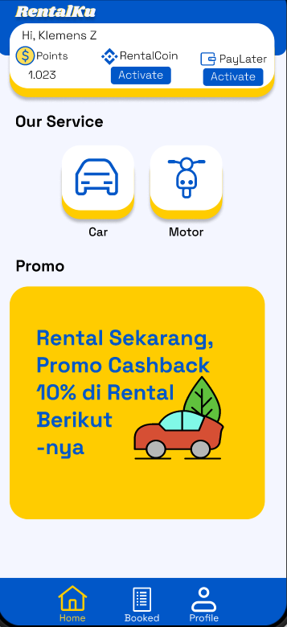
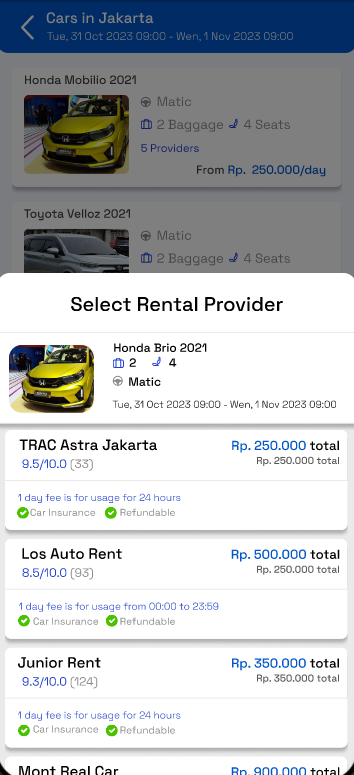
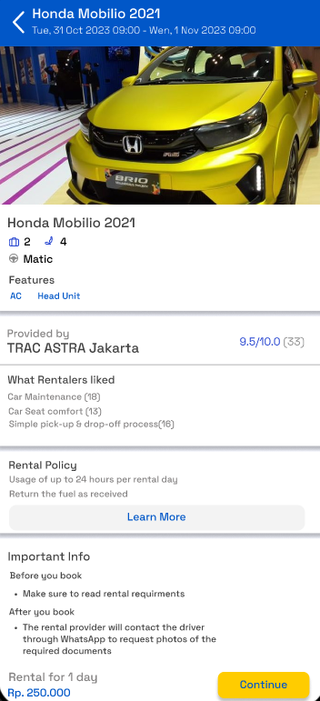
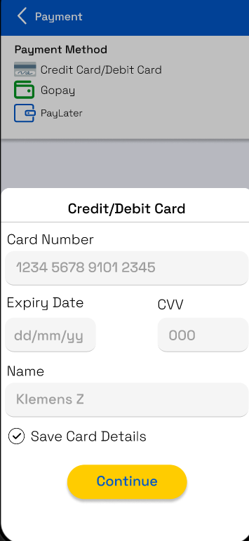
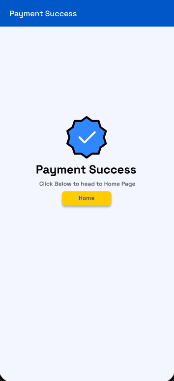

# 🚗 Rentalku — Mobile Car Rental App (UI/UX Prototype)

Rentalku is a mobile UI prototype for a vehicle rental platform that enables users to browse cars, compare rental providers, select rental dates, and complete payment — all through a seamless mobile experience.  
This design focuses on simplicity, clarity, and a modern rental-flow similar to platforms like Traveloka & Tiket.

> 🎨 Designed in Figma as a mobile-first experience.

---

## 🌟 Key Features

- 🔐 Login & Signup pages  
- 🏠 Home screen with rental categories & promo banner  
- 🚙 Car listing & provider comparison  
- 📅 Date & time picker for rental period  
- 📍 Pickup & drop-off address form  
- 💳 Multiple payment options (Card, GoPay, PayLater)  
- ✅ Booking confirmation screen with reference details  

---

## 🧠 Design Goals

- Clean, modern UI with familiar booking UX  
- Smooth user flow from browsing → booking → payment  
- Clear information hierarchy and readable UI components  
- High-contrast buttons and intuitive icon usage  

---

## 🛠️ Tools & Technologies

| Purpose | Tool |
|---|---|
UI Design | Figma  
Prototype Interaction | Figma Interactive Prototyping  
Platform | Mobile App (Android style UI)  

---

## 🧩 My Contribution

- Full UI design & flow structure  
- Layout, styling, color system, typography  
- Micro-interactions & prototype routing  
- User booking flow logic mapping  

---

## 📸 Screenshots Preview

  
  
  

  
  
  

---

## 🔗 Live Prototype (Figma)

[▶ View Figma Prototype](https://www.figma.com/proto/ahbLt5RhwhybrXPNl2NTyi/Mobile-Rentalku?node-id=7-242&p=f&t=BabZGbRY0U3XnFAy-0&scaling=scale-down&content-scaling=responsive&page-id=0%3A1&starting-point-node-id=7%3A242)

---

## 👤 Author

**Faith Greatfull Samuel Taressy**  
📧 faithtaressy043@gmail.com  
🔗 LinkedIn: https://www.linkedin.com/in/faithtaressy  

---

## ⭐ If you like this project

Drop a ⭐ on the repo — it helps a lot!
